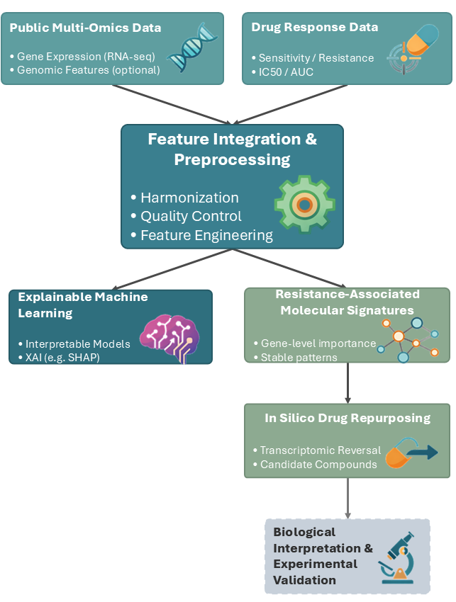

# Epigenetic Drug Resistance

This repository contains a reproducible computational framework to study mechanisms of drug resistance in cancer using multi-omics data and explainable machine learning approaches.

The project focuses on identifying interpretable molecular signatures associated with resistance phenotypes and leveraging these signatures for *in silico* drug repurposing. Publicly available datasets are used throughout the pipeline to ensure transparency and reproducibility.



## Project Goals

The main goal of this project is to develop an interpretable and reproducible pipeline to investigate molecular mechanisms underlying drug resistance in cancer.

Specifically, the project aims to:
- Integrate gene expression and other molecular features with drug response data.
- Train explainable machine learning models to identify resistance-associated signatures.
- Assess the stability and interpretability of these signatures across validation settings.
- Use resistance signatures to perform in silico drug repurposing analyses based on transcriptomic reversal.
- Provide a clear computational foundation for future experimental validation.

## Data Sources

This project uses publicly available datasets that combine molecular profiling of cancer cell lines with drug response measurements.

At a high level, the pipeline relies on:
- Gene expression data from large-scale cancer cell line resources.
- Drug sensitivity measurements derived from high-throughput screening experiments.
- Transcriptomic perturbation databases to support in silico drug repurposing analyses.

Detailed descriptions of each data source, their roles in the pipeline, and selection criteria are documented in `docs/DATA_SOURCES.md`.

## Repository Structure

The repository is organized to promote modularity, reproducibility, and clear separation of concerns throughout the project lifecycle.

``` text
epigenetic-drug-resistance/
│
├── data/
│   ├── raw/          # Original, unprocessed datasets
│   ├── interim/      # Intermediate data generated during preprocessing
│   └── processed/    # Final datasets used for modeling and analysis
│
├── docs/             # Project documentation and design decisions
│   ├── PROJECT_SCOPE.md
│   └── DATA_SOURCES.md
│
├── environments/     # Environment definitions and dependency management
│
├── notebooks/        # Exploratory analyses and pipeline orchestration
│
├── reports/          # Generated reports and summaries
│
├── results/
│   ├── figures/      # Plots and visual outputs
│   ├── models/       # Trained model artifacts
│   └── tables/       # Tabular results and summary statistics
│
├── src/
│   ├── data/         # Data ingestion and preprocessing scripts
│   ├── features/     # Feature engineering and transformation logic
│   ├── models/       # Model training, evaluation, and explainability
│   └── repurposing/  # Drug repurposing and signature reversal analyses
│
├── .gitignore
└── README.md
```

## Reproducibility and Design Principles

This project is designed with reproducibility and transparency as core principles.

Key design considerations include:
- Clear separation between raw, intermediate, and processed data.
- Modular code structure to facilitate reuse and extension.
- Deterministic workflows where possible, with controlled randomness.
- Emphasis on interpretability and biological plausibility over purely predictive performance.
- Exclusive use of publicly available data sources and documented processing steps.

## Project Status and Roadmap

This project is currently in its initial development phase.

Completed steps include:
- Definition of project scope and research objectives.
- Selection and documentation of data sources.
- Repository structure and design planning.

Planned next steps:
- Data ingestion and quality control for selected datasets.
- Feature engineering and construction of resistance phenotypes.
- Training and evaluation of interpretable machine learning models.
- Identification and analysis of resistance-associated molecular signatures.
- In silico drug repurposing analyses based on transcriptomic signature reversal.

This roadmap may evolve as new insights emerge during data exploration and modeling.

---

## Environment setup

This project was developed using **Python 3.11**.

To reproduce the environment:

```bash
git clone <https://github.com/paulairazoqui/epigenetic-drug-resistance>
cd epigenetic-drug-resistance

python -m venv .venv

# Windows (PowerShell)
.venv\Scripts\Activate.ps1

# Linux / macOS
source .venv/bin/activate

pip install -r requirements.txt
```

**Python 3.11 is recommended.**

The virtual environment (.venv/) is not versioned and must be created locally.

> On Windows systems with multiple Python versions installed, you can explicitly select Python 3.11 using:
> ```powershell
> py -3.11 -m venv .venv
> ```
