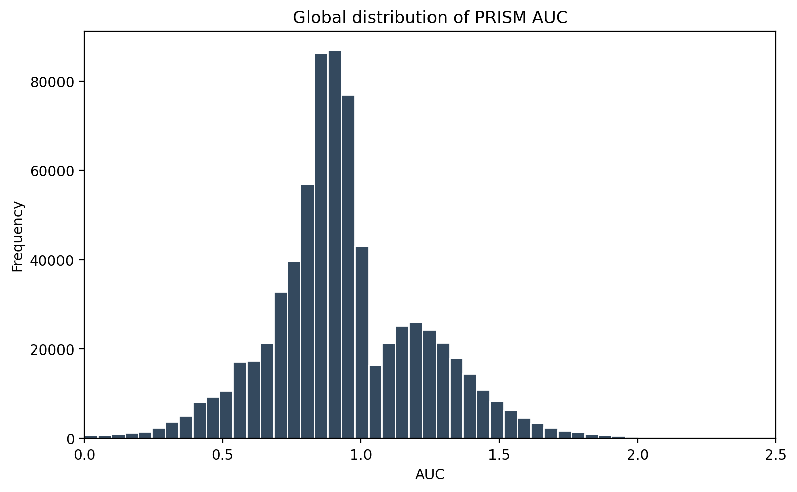
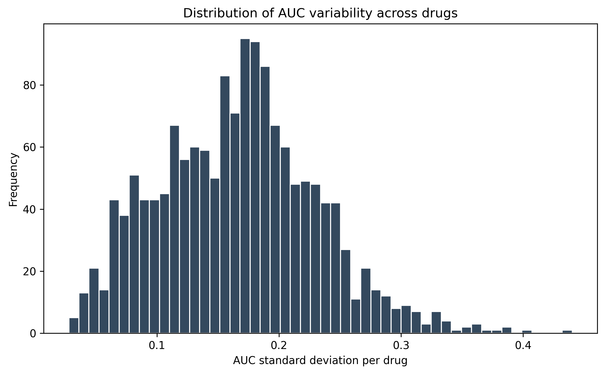
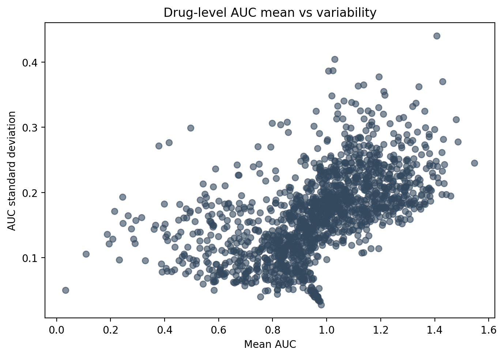

# EDA and target definition — DepMap expression & PRISM response

## Objective

This notebook performs exploratory data analysis (EDA) on the processed DepMap–PRISM dataset and defines the formal modeling strategy for downstream machine learning.

The goals of this step are to:

* Characterize the global distribution of drug response (AUC)
* Quantify drug-level heterogeneity across cell lines
* Identify compounds with meaningful response variability
* Select a representative subset of drugs for initial modeling
* Define the canonical modeling target and task formulation

This notebook operates exclusively on datasets generated in **Notebook 02** and produces no new derived biological features.

---

## Input datasets

| Dataset                         | Description                                                      |
|--------------------------------|------------------------------------------------------------------|
| `prism_auc_filtered.parquet`   | Filtered PRISM response table (cell line × drug)                |
| `drug_index.parquet`           | Drug-level summary statistics and coverage metrics              |
| `depmap_expression_matched.parquet` | Gene expression matrix aligned to PRISM-screened cell lines |

All input files were generated in the previous dataset construction step and assume a validated `join_id` mapping.

---

## Global response distribution (AUC)

The primary response variable is the PRISM area under the dose–response curve (`auc`).

### Summary statistics

| Metric | Value |
|--------|--------|
| Count  | **732,066** |
| Mean   | **0.943** |
| Std    | **0.282** |
| Min    | **0.000** |
| 25%    | **0.793** |
| 50%    | **0.907** |
| 75%    | **1.101** |
| Max    | **4.889** |

Interpretation:

* The AUC distribution is continuous and non-degenerate.
* The response spans a wide dynamic range.
* There is no evidence of response collapse or trivial targets.
* The distribution is suitable for regression modeling.

---

## Drug-level heterogeneity

Drug-level summary statistics were computed using the pre-aggregated `drug_index` table.

### Distribution of mean AUC per drug

The mean response across drugs is unimodal, centered around ~0.9–1.1, with both low-mean (sensitive) and high-mean (resistant) tails.

This indicates:

* A mixture of generally sensitive, generally resistant, and intermediate compounds.
* A non-trivial modeling space with heterogeneous baseline drug effects.

---

### Distribution of AUC variability per drug

The standard deviation of AUC across cell lines (`auc_std`) shows:

* A central peak around ~0.15–0.20
* A long tail up to ~0.45
* Very few drugs with near-zero variance

Interpretation:

* The majority of compounds exhibit meaningful heterogeneity across cell lines.
* Only a small fraction of drugs are trivial (uniform response).
* Most drugs are suitable for learning response-specific predictors.

---

### Mean vs variability relationship

A scatter plot of drug-level mean AUC versus AUC standard deviation reveals:

* A positive relationship between response extremity and variability
* A dense central region of compounds with:
  - Intermediate mean AUC
  - Moderate to high variability

This highlights three broad drug categories:

1) **Trivial compounds**  
   * Extreme mean AUC  
   * Low variability  
   * Uniform response across cell lines  
   → Not suitable for ML modeling

2) **Informative ML targets**  
   * Intermediate mean AUC  
   * High variability  
   * Heterogeneous response  
   → Ideal modeling candidates

3) **Extreme but heterogeneous compounds**  
   * Extreme mean AUC  
   * High variability  
   * Outlier responders  
   → Also potentially informative

---

## Selection of drugs for initial modeling

To define a representative and tractable modeling subset, objective selection criteria were applied.

### Selection criteria

Drugs were filtered using the following thresholds:

| Criterion | Threshold |
|----------|-----------|
| Minimum cell-line coverage | ≥ 200 |
| Minimum AUC standard deviation | ≥ 0.15 |
| Minimum mean AUC | ≥ 0.60 |
| Maximum mean AUC | ≤ 1.30 |

These criteria enforce:

* Sufficient statistical support per compound  
* Meaningful heterogeneity across cell lines  
* Exclusion of extreme and trivial targets  

---

### Candidate drug pool

| Metric | Value |
|--------|--------|
| Candidate drugs satisfying all criteria | **811** |

This confirms that a large fraction of compounds are intrinsically ML-suitable.

---

### Selected modeling subset

From the candidate pool, a prioritized subset was selected based on:

1) Highest cell-line coverage  
2) Highest response variability  

| Metric | Value |
|--------|--------|
| Selected drugs | **100** |
| Minimum AUC std (selected) | **0.151** |
| Mean AUC std (selected) | **0.194** |

This subset:

* Is well-covered across cell lines  
* Exhibits strong heterogeneity  
* Contains clinically and biologically relevant compounds  
* Is computationally tractable for baseline modeling  

The full selected set is stored in:

* `selected_drugs.parquet`

---

## Target definition and modeling strategy

The canonical modeling task is defined as:

* **Primary task**: Regression  
  Predict continuous PRISM AUC values from gene expression profiles.

### Rationale

* AUC is continuous and non-degenerate.
* Drug-level response shows substantial heterogeneity.
* Regression preserves maximal information content.
* Binarization introduces arbitrary thresholds and information loss.

### Secondary task (future extension)

* Binary sensitivity classification (sensitive vs resistant)  
* Drug-specific or quantile-based thresholds  
* To be explored as a downstream extension

The formal target definition is stored in:

* `03_target_definition.json`

---

## Final outputs

The following artifacts are generated in this notebook:

| File | Description |
|------|-------------|
| `selected_drugs.parquet` | Subset of 100 prioritized modeling drugs |
| `03_selected_drugs_summary.json` | Drug selection criteria and statistics |
| `03_target_definition.json` | Formal modeling target definition |

These files constitute the modeling design contract for downstream notebooks.

---

## Conclusions

This notebook establishes the formal modeling design layer of the pipeline.

Key outcomes:

* The PRISM AUC response is continuous, stable, and ML-suitable.
* Drug-level heterogeneity is substantial across cell lines.
* A large pool of intrinsically learnable compounds exists.
* A representative subset of 100 drugs was selected for baseline modeling.
* Regression is defined as the canonical modeling task.

The pipeline may now proceed to:

* Dataset assembly per drug  
* Train/validation/test split definition  
* Baseline regression modeling  
* Performance evaluation  
* Feature attribution and interpretability analysis  

with high confidence in data integrity and modeling relevance.

---

## Notes

This stage deliberately separates:

* Dataset construction (Notebook 02)  
* Exploratory analysis and design decisions (this notebook)  
* Model training and evaluation (subsequent notebooks)  

to enforce modularity, reproducibility, and clear scientific traceability across the full pipeline.

All downstream notebooks assume:

* The selected drug subset defined here  
* The continuous AUC regression setup  
* The processed datasets generated previously
